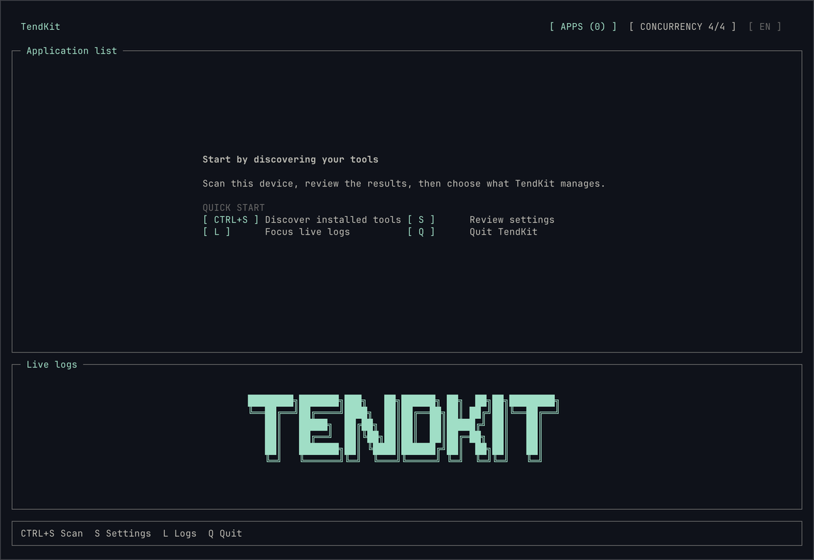

# TendKit

<p align="center">
  
</p>

> 在一个地方管理你的开发工具，及时发现更新，一切由你掌控。

[English](README.md) | [简体中文](README_ZH_CN.md)

开发工具散落在 `PATH`、包管理器和应用目录中。想知道安装了什么、哪些需要处理和及时更新，可能你已经忘记了。

TendKit 把它们集中到一个终端面板中。扫描本机、查看安装状态、检查新版本，只更新你需要的工具。

TendKit 在 macOS 和 Linux 本地运行。它的目的不是替代现有包管理器，而是提供更简单的方式让你管理现有开发环境。

<p align="center">
  
</p>

## ✨ 为什么选择 TendKit？

|     | 你可以获得什么                                                           |
| --- | ------------------------------------------------------------------------ |
| 🧰   | **一份清晰的工具清单** — 在同一个界面查看 CLI、全局包和 macOS 开发应用。 |
| 🔎   | **少做重复检查** — 不必记住每个工具的命令，TendKit 主动识别并自动管理。 |
| 🎛️   | **每次都由你决定** — 只检查、自动更新，或者先下载制品稍后处理。          |
| ✅   | **变更先审核** — 新发现的工具和扫描变更都可以接受或拒绝。                |
| 🛡️   | **生产就绪** — 内置重复识别、任务、安全配置写回和审计日志。              |
| 📝   | **配置优先** — 一切即配置，喜欢什么就自己加。                            |

TendKit 继续使用现有包管理器和更新方式。它提供统一的查看与操作入口，但不会替代这些工具。

## 🎯 适用场景

| 场景                 | TendKit 如何帮助你                                                     |
| -------------------- | ---------------------------------------------------------------------- |
| **配置或盘点开发机** | 扫描一次，得到可审核的工具清单，不再逐个开发环境手工排查。                 |
| **日常维护**         | 一次检查所有已纳管工具，只关注真正有新版本的项目。                     |
| **保护稳定环境**     | 逐项查看结果，只更新选中的工具，避免盲目批量升级。                     |
| **混合安装来源**     | 在一个界面查看 PATH 工具、全局 npm/Python/Go/uv/Ruby 包和 macOS 应用。 |

## 🧭 工作方式

1. **扫描** — 发现本机支持的开发工具。
2. **审核** — 决定加入、编辑或排除哪些发现结果。
3. **检查** — 在一个界面比较当前版本与最新版本。
4. **处理** — 执行已配置的更新方式，或下载制品稍后处理。

## 🚀 快速开始

### 📦 安装 TendKit

从 [Latest GitHub Release](https://github.com/eoctet/tendkit/releases/latest) 下载对应系统的包，解压后把 `tendkit` 放入 `PATH`。

支持的运行环境：

- macOS 或 Linux
- `arm64` 或 `x86_64`
- Ubuntu、Debian、CentOS 和 Red Hat Enterprise Linux

暂不支持 Windows。下载默认支持 `curl` 或 `aria2c`（需自行安装）。

Go 用户也可以直接安装组件库：

```bash
go install github.com/eoctet/tendkit/cmd/tendkit@VERSION
```

> 将 `VERSION` 替换为 `v0.1.0-rc.1` 等标签。

### 🧩 命令行选项

```text
tendkit [选项]
tendkit version [选项]

--config PATH    使用其他配置文件
--lock PATH      使用其他进程锁文件
--color MODE     auto、always 或 never
--lang LANG      en 或 zh
--env-file PATH  加载指定的环境变量文件
--no-env-file    禁用全部环境变量文件加载
```

TUI 启动后会创建 `~/.config/tendkit/config.json` 及其父目录，不会覆盖已有配置。扫描、版本检查、下载、更新和设置都在 TUI 中完成。

## 🔍 TendKit 可以发现什么

TendKit 可以扫描并且识别：

- `PATH` 中受支持的开发 CLI；
- npm、Python、Go、uv 和 Ruby 管理的全局包；
- macOS 中 `/Applications` 和 `~/Applications` 下的开发应用。

它可以通过 GitHub Releases 与 tags、npm、PyPI、uv、JetBrains、Go、Node.js、Sparkle feed 和自定义命令检查版本。具体能力取决于工具或包管理器能够提供的信息。当前不扫描项目内依赖和虚拟环境。

## 🛡️ 安全与控制

- 使用当前用户权限运行，不会自动添加 `sudo`。
- 新发现和扫描变更需要先审核。
- 只有你主动执行时，才会更新、下载或安装。
- 保存前校验配置，并以原子方式写回。
- 存在可信校验信息时，可使用 SHA-256 验证下载制品。
- 保持包安装的默认权限。
- 对凭据、令牌、加密密钥和其他敏感信息进行脱敏。

自定义 Provider action 是 shell 命令。请像代码一样审查，不要在配置或日志中保存凭据、令牌或加密密钥。配置示例、完整操作与安全模型见[产品使用手册](wiki/user-manual_ZH_CN.md)。

## 🛠️ 从源码构建

构建需要 Go 1.23 或更高版本；准确开发工具链见 [`go.mod`](go.mod)。

```bash
git clone https://github.com/eoctet/tendkit.git
cd tendkit
go build -o ./bin/tendkit ./cmd/tendkit
./bin/tendkit
```

## 📚 文档

- [产品使用手册](wiki/user-manual_ZH_CN.md) · [English](wiki/user-manual.md)
- [开发与技术规范](wiki/development-and-technical-guide_ZH_CN.md) · [English](wiki/development-and-technical-guide.md)

## 💬 意见反馈和贡献

发现 Bug 或有新的想法？请使用仓库中的中英文 Issue Form。提交前先搜索已有 Issue，不要提交凭据、令牌、加密密钥、私有路径或未经脱敏的个人与系统信息。

想贡献代码或文档？请先阅读 [`CONTRIBUTING_ZH_CN.md`](CONTRIBUTING_ZH_CN.md)。保持改动聚焦，补充相关测试，并说明如何验证结果。

不要在公开 Issue 中报告安全漏洞。请遵循 [`SECURITY_ZH_CN.md`](SECURITY_ZH_CN.md) 中的私下报告流程。

## 📄 License

TendKit 基于 [MIT License](LICENSE) 发布。
