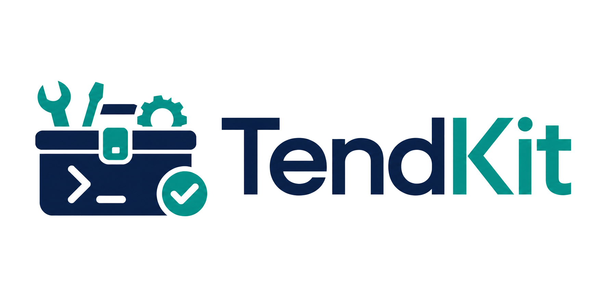

# TendKit

<p align="center">
  
</p>

> 看清所有工具，及时发现更新，一切由你掌控。

[English](README.md) | [简体中文](README_ZH_CN.md)

开发工具散落在 `PATH`、语言包管理器和应用目录中。想知道安装了什么、哪些需要更新，往往要执行一堆不同的命令。

TendKit 把它们集中到一个终端面板中。扫描本机、查看安装状态、检查新版本，只更新你选择的工具。

TendKit 在 macOS 和 Linux 本地运行。它不会替代现有包管理器，也不会把更新变成不受控制的批量命令。

> TendKit 当前版本为 `0.1.0`，仍处于预发布阶段。

## ✨ 为什么选择 TendKit？

| | 你可以获得什么 |
| --- | --- |
| 🧰 | **一份清晰的工具清单** — 在同一个界面查看 CLI、全局包和 macOS 开发应用。 |
| 🔎 | **少做重复检查** — 不必记住每个工具的版本命令，也能比较当前版本和最新版本。 |
| 🎛️ | **每次都由你决定** — 只检查、自动更新，或者先下载制品稍后处理。 |
| ✅ | **变更先审核** — 新发现的工具和扫描变更都可以接受或拒绝。 |
| 🛡️ | **适合真实开发机** — 内置重复识别、任务取消、安全配置写回和结构化日志。 |
| 🌐 | **支持中英文** — 可在启动时或设置中切换界面语言。 |

## 🧭 工作方式

1. 🔍 **扫描** — 从 `PATH`、全局包生态和 macOS 应用目录发现支持的工具。
2. 👀 **审核** — 由你决定保留哪些发现结果和配置变更。
3. 🚀 **检查或更新** — TendKit 为每个工具选择合适的 Provider，并在 TUI 中展示结果。

支持的数据来源包括 GitHub Releases 与 tags、npm、PyPI、uv、JetBrains、Go、Node.js、Sparkle feed 和自定义命令。

## 🚀 快速开始

### ✅ 运行要求

- `arm64` 或 `x86_64` 架构的 macOS 或 Linux
- Go 1.23 或更高版本；准确开发工具链见 [`go.mod`](go.mod)
- `aria2c` 或 `curl`：仅下载制品时需要

暂不支持 Windows。支持的 Linux 发行版为 Ubuntu、Debian、CentOS 和 Red Hat Enterprise Linux。

### 🛠️ 构建并运行

```bash
git clone https://github.com/eoctet/tendkit.git
cd tendkit
mkdir -p bin
go build -o ./bin/tendkit ./cmd/tendkit
tendkit_bin="$(pwd)/bin/tendkit"

mkdir -p /tmp/tendkit-demo
cd /tmp/tendkit-demo
"$tendkit_bin" --no-env-file
```

TendKit 会打开终端界面，并在启动目录创建 `conf/config.json`，不会覆盖已有配置。首次使用临时目录，可以让体验数据与日常工作目录保持隔离。

## ⌨️ 日常操作

| 按键 | 操作 |
| --- | --- |
| `↑` / `↓` | 选择工具 |
| `ENTER` | 打开详情或确认操作 |
| `SPACE` | 启用或停用当前工具 |
| `C` / `A` | 检查当前工具 / 检查全部 |
| `U` / `CTRL+U` | 更新当前工具 / 更新全部 |
| `F` | 搜索 |
| `S` / `CTRL+S` | 打开设置 / 扫描管理 |
| `L` | 查看日志 |
| `ESC` | 返回或取消 |
| `Q` | 退出 |

字母快捷键区分大小写。

### 🧩 命令行选项

```text
tendkit [选项]
tendkit version [选项]

--config PATH    使用其他配置文件
--lock PATH      使用其他进程锁文件
--color MODE     auto、always 或 never
--lang LANG      en 或 zh
--env-file PATH  加载指定环境变量文件
--no-env-file    不加载启动目录中的 .env
```

扫描、版本检查、下载、更新和设置都在 TUI 中完成。

## 🛡️ 默认安全

TendKit 让操作始终可控：

- 使用当前用户权限执行命令，不会自动添加 `sudo`。
- 执行命令或保存变更前先校验配置。
- 锁定正在使用的配置，并以原子方式写回。
- 存在可信校验信息时，可使用 SHA-256 验证下载制品。
- 支持取消任务，并终止相应子进程组。
- 将运行日志写入 `logs/run.log`，并限制保留数量。

自定义 Provider action 是 shell 命令。请像代码一样审查，不要在配置或日志中保存凭据和令牌。完整操作与安全模型见[产品用户手册](docs/product/user-manual.md)。

## 📚 文档

- [产品用户手册](docs/product/user-manual.md)
- [功能与产品边界](docs/architecture/features.md)
- [架构设计](docs/architecture/architecture.md)
- [开发规范](docs/architecture/development.md)
- [技术栈规范](docs/architecture/technology-stack.md)
- [TUI 交互设计](docs/product/tui-interaction-design.md)

详细产品与架构文档目前以简体中文维护。

## 💬 意见反馈和贡献

发现 Bug 或有新的想法？请使用仓库中的中英文 Issue Form。提交前先搜索已有 Issue，并从日志和截图中删除秘密与私人信息。

想贡献代码或文档？请先阅读 [`CONTRIBUTING_ZH_CN.md`](CONTRIBUTING_ZH_CN.md)。保持改动聚焦，补充相关测试，并说明如何验证结果。

不要在公开 Issue 中报告安全漏洞。请遵循 [`SECURITY_ZH_CN.md`](SECURITY_ZH_CN.md) 中的私下报告流程。

## 📄 License

TendKit 基于 [MIT License](LICENSE) 发布。
